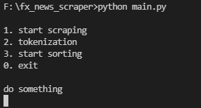
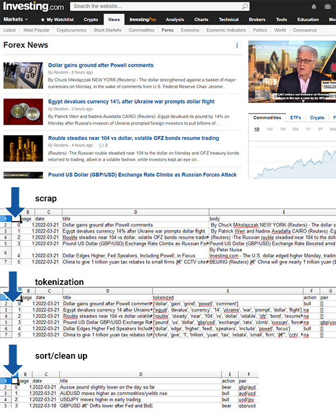

A scraper for investing.com forex news, using beautifulsoup and nltk.

It identifies pairs in news headlines and figures out which way (bull or bear) the pairs would go using tokenization and a bull/bear vocabulary.

    

    

The output csv files are saved in /data folder.
